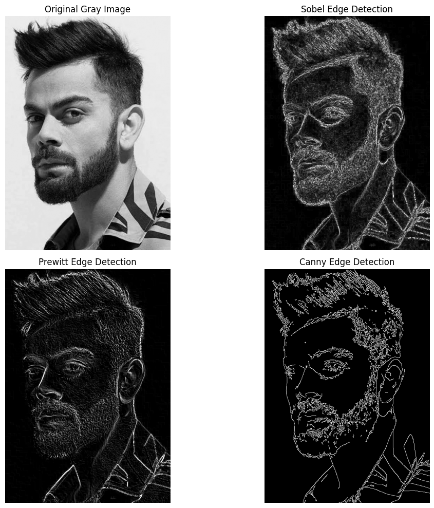

# Edge Detection Using OpenCV

## Output

The output image shows the **original grayscale image** along with the edge detection results obtained using three different methods:

- **Sobel Edge Detection**
- **Prewitt Edge Detection**
- **Canny Edge Detection**

## Methods Used

### 1. Sobel Edge Detection
Detects edges by calculating the intensity changes in the horizontal and vertical directions.

### 2. Prewitt Edge Detection
Uses convolution filters to identify horizontal and vertical edges in an image.

### 3. Canny Edge Detection
Detects clear and thin edges using multiple processing steps such as noise reduction, gradient calculation, and thresholding.

## Technologies Used

- Python
- OpenCV
- NumPy
- Matplotlib

# Author

**Shaik Khaja Moin**
